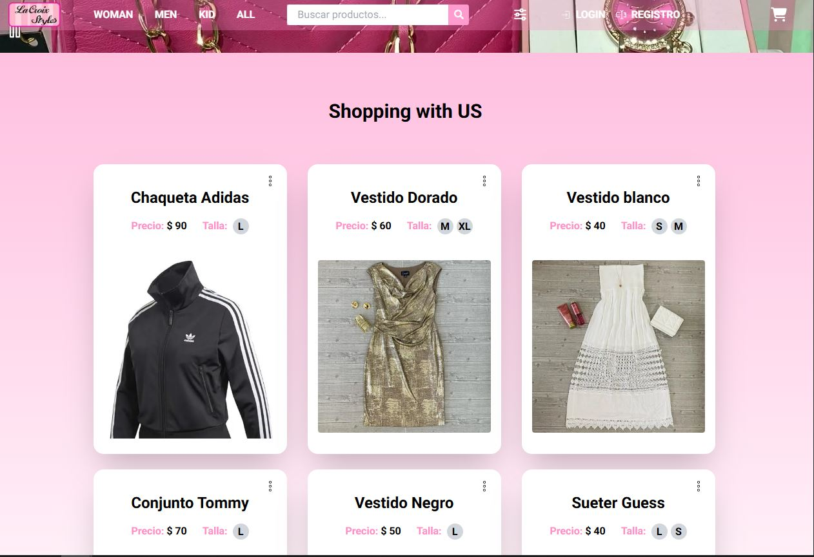
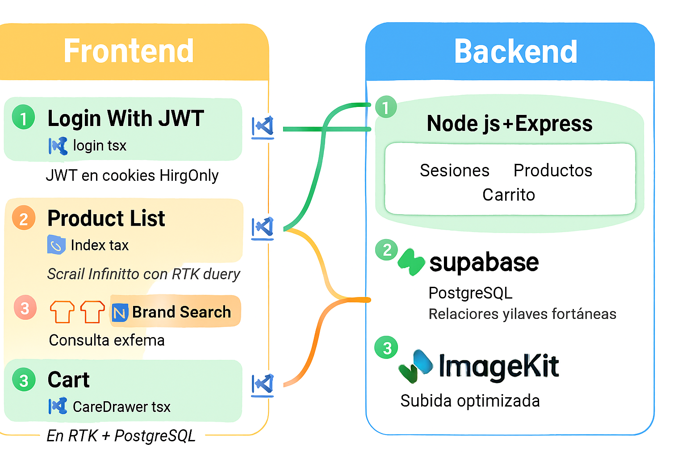
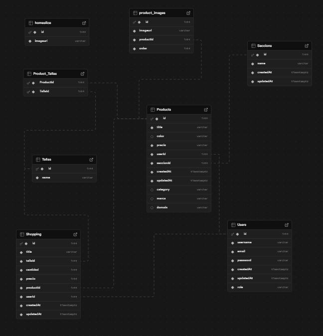

🛍️ Sistema de gestión de productos con integración inteligente de marcas

📌 Descripción
Aplicación web para crear, visualizar y administrar productos, incluyendo imágenes, tallas, precios, marcas y carrito de compras. Incorpora una búsqueda reactiva de marcas mediante la API de Brandfetch, corrigiendo errores de escritura y asociando íconos y nombres válidos. Implementa patrones de seguridad, renderizado correcto, subida optimizada de imágenes y despliegue reproducible.

🚀 Tecnologías
- Frontend: React.js, Next.js, TypeScript, redux toolkit, redux toolkit Query
- Backend: Node.js, Express, JWT (HttpOnly), PostgreSQL
- Base de datos: Supabase (visualización de relaciones y claves foráneas)
- Autenticación: JWT en cookies HttpOnly con logout seguro (sameSite: "None", path: "/")
- Imágenes: ImagenKit (CDN para subida y optimización de imágenes)
- API externa: Brandfetch (integración segura por header con validación de CORS dinámico)
- Carrito: RTK para estado local + persistencia en PostgreSQL por usuario autenticado
- Despliegue: Vercel / Render
- Control de versiones: Git + GitHub

🧪 Funcionalidades
- Crear producto con:
- 📷 Imágenes (subida vía ImagenKit)
- 📏 Talla
- 💲 Precio
- 🏷️ Marca (con corrección asistida vía Brandfetch)
- Visualizar productos con su marca asociada
- Búsqueda por nombre y precio
- Filtros personalizables por categoría
- Ordenamiento por precio
- Rutas protegidas por rol (admin, usuario)
- Logout seguro en todos los entornos (incluyendo móvil)
- 🛒 Carrito de compras persistente:
- Añadir, eliminar y modificar cantidad
- Estado local con RTK
- Guardado en PostgreSQL por usuario autenticado

🔐 Patrones aplicados
- Autenticación segura con JWT en cookies HttpOnly
- Logout funcional en móviles (sameSite: "None", path: "/")
- Renderizado correcto en listas dinámicas (claves únicas y estables)
- Input controlado con búsqueda reactiva
- Integración externa segura por header (Brandfetch API)
- Subida de imágenes optimizada con CDN (ImagenKit)
- Estado global con RTK + persistencia de carrito en PostgreSQL

🧭 Arquitectura visual
Arquitectura del ecommerce
Este diagrama muestra el flujo completo entre frontend, backend, base de datos y servicios externos. Destaca:
- 🔐 Autenticación con JWT HttpOnly
- 🛒 Carrito sincronizado con PostgreSQL
- 📷 Subida optimizada con ImagenKit
- 🧠 Búsqueda reactiva de marcas vía Brandfetch
- 🧩 Slices en RTK y consultas con RTK Quer

🧬 Modelo relacional en PostgreSQL (Supabase + Sequelize)

- 🔐 User
- 🛒 Shopping (carrito)
- 📦 Product
- 🧵 Talla
- 🔗 Product_Talla (relación muchos a muchos)
- 🖼️ product_images
- 🗂️ Seccion (categoría o agrupación)
- 🧠 homeslice (vista personalizada o destacada)

